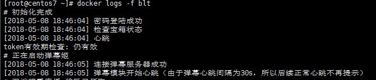

# bilibili-live-tools-docker

在steamcn上看到的推荐，发现了这款软件，不过原帖子中介绍的运行环境配置是Ubuntu的配置方式，虽然我在后面补充了CentOS的配置，觉得还是有点麻烦，在此写了一个Dockerfile进行简单部署

----
软件地址：https://github.com/yjqiang/bilibili-live-tools

----
环境
----
Docker version 18.04.0-ce

----
## 使用介绍

1、下载一份源文件到本地
```
git clone https://github.com/Muromi-Rikka/bilibili-live-tools-docker
```
2、把目录下文件 bilibili.conf 中的username和password填写

3、进入目录构建容器
```
cd bilib*
docker build -t bltc:mine .
```
4、查看镜像构建是否成功
```
docker images
```
如果构建成功会显示类似如下文字


5、建立容器
```
docker run -itd --name blt bltc:mine
```

6、查看容器运行状况
```
docker logs -f blt
``` 
显示类似如下信息则运行成功

